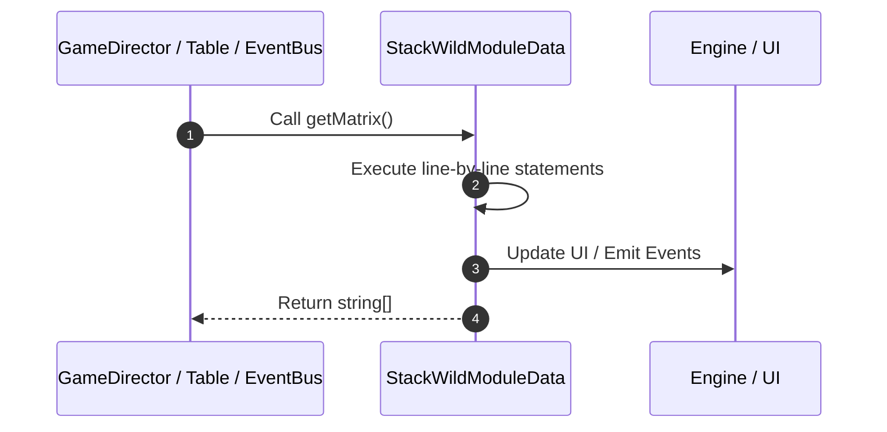

# 📖 `StackWildModuleData.getMatrix()`

<!-- convention-summary-start -->
### StackWildModuleData.getMatrix Line-by-Line Method Walkthrough Summary

- **Core Architecture / Purpose**: Technical reference, API contract, and integration guide for StackWildModuleData.getMatrix Line-by-Line Method Walkthrough.
- **Key Mechanisms & Design**: Encapsulates core algorithms, event hooks, and performance optimizations within the slot framework runtime.
- **Domain Capabilities**: game_implement, 03_methods
- **Scope & Code Paths**: `file:///C:/Users/ADMIN/lamnino/cc20-new-all-in-one/assets/cc-release-slot/cc1-red-cliff/scripts/Table/StackWildModuleData.ts`
- **Related Docs**: [Master Index](../INDEX.md)
<!-- convention-summary-end -->


---

## 1. Method Signature & Overview

```typescript
public getMatrix(): string[]
```

- **Declaring Class**: `StackWildModuleData` ([`StackWildModuleData.ts`](file:///C:/Users/ADMIN/lamnino/cc20-new-all-in-one/assets/cc-release-slot/cc1-red-cliff/scripts/Table/StackWildModuleData.ts))
- **Source Range**: Lines 116 to 119
- **Execution Cost**: $O(1)$ synchronous logic or timer Promise.

---

## 2. Complete Source Implementation

```typescript
	getMatrix(): string[] {
		const rawMatrix = this.getRawMatrix();
		return this.getMainTableMegaMatrix(Array.from(rawMatrix));
	}
```

---

## 3. Line-by-Line Code Breakdown

| Line # | Code Snippet | Technical Analysis & Engine Behavior |
| :---: | :--- | :--- |
| **116** | `getMatrix(): string[] {` | Method entry signature declaring `getMatrix()` returning `string[]`. |
| **117** | `const rawMatrix = this.getRawMatrix();` | Allocates local variable `rawMatrix`. |
| **118** | `return this.getMainTableMegaMatrix(Array.from(rawMatrix));` | Returns value or promise to calling sequence. |
| **119** | `}` | Scope boundary closing block. |

---

## 4. Execution Call Graph & Sequence


