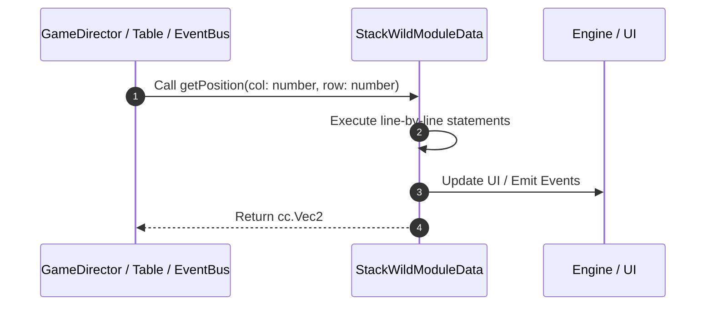

# 📖 `StackWildModuleData.getPosition()`

<!-- convention-summary-start -->
### StackWildModuleData.getPosition Line-by-Line Method Walkthrough Summary

- **Core Architecture / Purpose**: Technical reference, API contract, and integration guide for StackWildModuleData.getPosition Line-by-Line Method Walkthrough.
- **Key Mechanisms & Design**: Encapsulates core algorithms, event hooks, and performance optimizations within the slot framework runtime.
- **Domain Capabilities**: game_implement, 03_methods
- **Scope & Code Paths**: `file:///C:/Users/ADMIN/lamnino/cc20-new-all-in-one/assets/cc-release-slot/cc1-red-cliff/scripts/Table/StackWildModuleData.ts`
- **Related Docs**: [Master Index](../INDEX.md)
<!-- convention-summary-end -->


---

## 1. Method Signature & Overview

```typescript
public getPosition(col: number, row: number): cc.Vec2
```

- **Declaring Class**: `StackWildModuleData` ([`StackWildModuleData.ts`](file:///C:/Users/ADMIN/lamnino/cc20-new-all-in-one/assets/cc-release-slot/cc1-red-cliff/scripts/Table/StackWildModuleData.ts))
- **Source Range**: Lines 49 to 54
- **Execution Cost**: $O(1)$ synchronous logic or timer Promise.

---

## 2. Complete Source Implementation

```typescript
	getPosition(col: number, row: number): cc.Vec2 {
		if (this._positions[col] && this._positions[col][row]) {
			return this._positions[col][row];
		}
		return cc.Vec2.ZERO;
	}
```

---

## 3. Line-by-Line Code Breakdown

| Line # | Code Snippet | Technical Analysis & Engine Behavior |
| :---: | :--- | :--- |
| **49** | `getPosition(col: number, row: number): cc.Vec2 {` | Method entry signature declaring `getPosition(col: number, row: number)` returning `cc.Vec2`. |
| **50** | `if (this._positions[col] && this._positions[col][row]) {` | Conditional guard evaluating branching prerequisite. |
| **51** | `return this._positions[col][row];` | Returns value or promise to calling sequence. |
| **52** | `}` | Scope boundary closing block. |
| **53** | `return cc.Vec2.ZERO;` | Returns value or promise to calling sequence. |
| **54** | `}` | Scope boundary closing block. |

---

## 4. Execution Call Graph & Sequence


