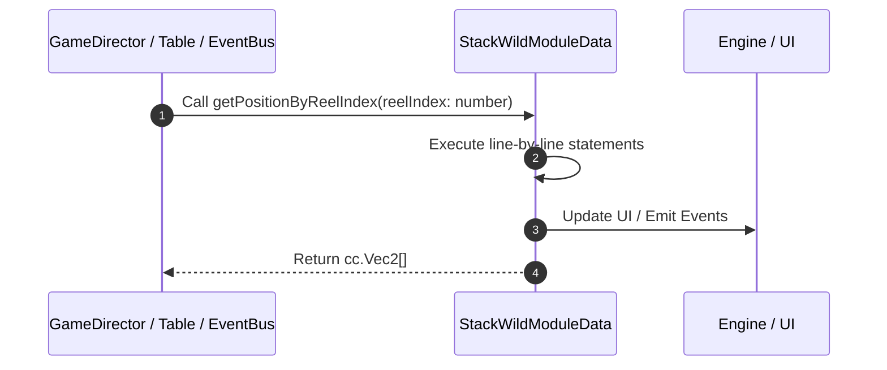

# 📖 `StackWildModuleData.getPositionByReelIndex()`

<!-- convention-summary-start -->
### StackWildModuleData.getPositionByReelIndex Line-by-Line Method Walkthrough Summary

- **Core Architecture / Purpose**: Technical reference, API contract, and integration guide for StackWildModuleData.getPositionByReelIndex Line-by-Line Method Walkthrough.
- **Key Mechanisms & Design**: Encapsulates core algorithms, event hooks, and performance optimizations within the slot framework runtime.
- **Domain Capabilities**: game_implement, 03_methods
- **Scope & Code Paths**: `file:///C:/Users/ADMIN/lamnino/cc20-new-all-in-one/assets/cc-release-slot/cc1-red-cliff/scripts/Table/StackWildModuleData.ts`
- **Related Docs**: [Master Index](../INDEX.md)
<!-- convention-summary-end -->


---

## 1. Method Signature & Overview

```typescript
public getPositionByReelIndex(reelIndex: number): cc.Vec2[]
```

- **Declaring Class**: `StackWildModuleData` ([`StackWildModuleData.ts`](file:///C:/Users/ADMIN/lamnino/cc20-new-all-in-one/assets/cc-release-slot/cc1-red-cliff/scripts/Table/StackWildModuleData.ts))
- **Source Range**: Lines 65 to 73
- **Execution Cost**: $O(1)$ synchronous logic or timer Promise.

---

## 2. Complete Source Implementation

```typescript
	getPositionByReelIndex(reelIndex: number): cc.Vec2[] {
		const tableFormat = this._config.TABLE_FORMAT;
		const rows = tableFormat[reelIndex];
		const result: cc.Vec2[] = [];
		for (let row = 0; row < rows; row++) {
			result.push(this.getPosition(reelIndex, row));
		}
		return result;
	}
```

---

## 3. Line-by-Line Code Breakdown

| Line # | Code Snippet | Technical Analysis & Engine Behavior |
| :---: | :--- | :--- |
| **65** | `getPositionByReelIndex(reelIndex: number): cc.Vec2[] {` | Method entry signature declaring `getPositionByReelIndex(reelIndex: number)` returning `cc.Vec2[]`. |
| **66** | `const tableFormat = this._config.TABLE_FORMAT;` | Allocates local variable `tableFormat`. |
| **67** | `const rows = tableFormat[reelIndex];` | Allocates local variable `rows`. |
| **68** | `const result: cc.Vec2[] = [];` | Allocates local variable `result: cc.Vec2[]`. |
| **69** | `for (let row = 0; row < rows; row++) {` | Executes core logic. |
| **70** | `result.push(this.getPosition(reelIndex, row));` | Executes core logic. |
| **71** | `}` | Scope boundary closing block. |
| **72** | `return result;` | Returns value or promise to calling sequence. |
| **73** | `}` | Scope boundary closing block. |

---

## 4. Execution Call Graph & Sequence


