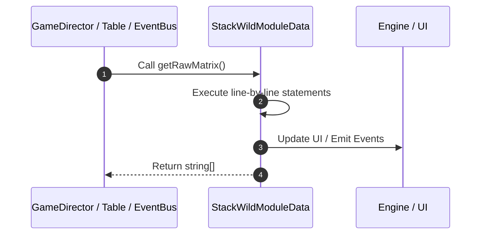

# 📖 `StackWildModuleData.getRawMatrix()`

<!-- convention-summary-start -->
### StackWildModuleData.getRawMatrix Line-by-Line Method Walkthrough Summary

- **Core Architecture / Purpose**: Technical reference, API contract, and integration guide for StackWildModuleData.getRawMatrix Line-by-Line Method Walkthrough.
- **Key Mechanisms & Design**: Encapsulates core algorithms, event hooks, and performance optimizations within the slot framework runtime.
- **Domain Capabilities**: game_implement, 03_methods
- **Scope & Code Paths**: `file:///C:/Users/ADMIN/lamnino/cc20-new-all-in-one/assets/cc-release-slot/cc1-red-cliff/scripts/Table/StackWildModuleData.ts`
- **Related Docs**: [Master Index](../INDEX.md)
<!-- convention-summary-end -->


---

## 1. Method Signature & Overview

```typescript
public getRawMatrix(): string[]
```

- **Declaring Class**: `StackWildModuleData` ([`StackWildModuleData.ts`](file:///C:/Users/ADMIN/lamnino/cc20-new-all-in-one/assets/cc-release-slot/cc1-red-cliff/scripts/Table/StackWildModuleData.ts))
- **Source Range**: Lines 121 to 135
- **Execution Cost**: $O(1)$ synchronous logic or timer Promise.

---

## 2. Complete Source Implementation

```typescript
	getRawMatrix(): string[] {
		let rawMatrix = this["matrix"] || this["matrix0"] || [];
		switch (this["state"]) {
			case 0: // NORMAL_GAME
				rawMatrix = this["normalGameMatrix"] || rawMatrix;
				break;
			case 1: // FREE_GAME
				rawMatrix = this["freeGameMatrix"] || rawMatrix;
				break;
			case 2: // RESPIN_GAME
				rawMatrix = this["respinGameMatrix"] || rawMatrix;
				break;
		}
		return rawMatrix;
	}
```

---

## 3. Line-by-Line Code Breakdown

| Line # | Code Snippet | Technical Analysis & Engine Behavior |
| :---: | :--- | :--- |
| **121** | `getRawMatrix(): string[] {` | Method entry signature declaring `getRawMatrix()` returning `string[]`. |
| **122** | `let rawMatrix = this["matrix"] \|\| this["matrix0"] \|\| [];` | Allocates local variable `rawMatrix`. |
| **123** | `switch (this["state"]) {` | Executes core logic. |
| **124** | `case 0: // NORMAL_GAME` | Executes core logic. |
| **125** | `rawMatrix = this["normalGameMatrix"] \|\| rawMatrix;` | Executes core logic. |
| **126** | `break;` | Executes core logic. |
| **127** | `case 1: // FREE_GAME` | Executes core logic. |
| **128** | `rawMatrix = this["freeGameMatrix"] \|\| rawMatrix;` | Executes core logic. |
| **129** | `break;` | Executes core logic. |
| **130** | `case 2: // RESPIN_GAME` | Executes core logic. |
| **131** | `rawMatrix = this["respinGameMatrix"] \|\| rawMatrix;` | Executes core logic. |
| **132** | `break;` | Executes core logic. |
| **133** | `}` | Scope boundary closing block. |
| **134** | `return rawMatrix;` | Returns value or promise to calling sequence. |
| **135** | `}` | Scope boundary closing block. |

---

## 4. Execution Call Graph & Sequence


