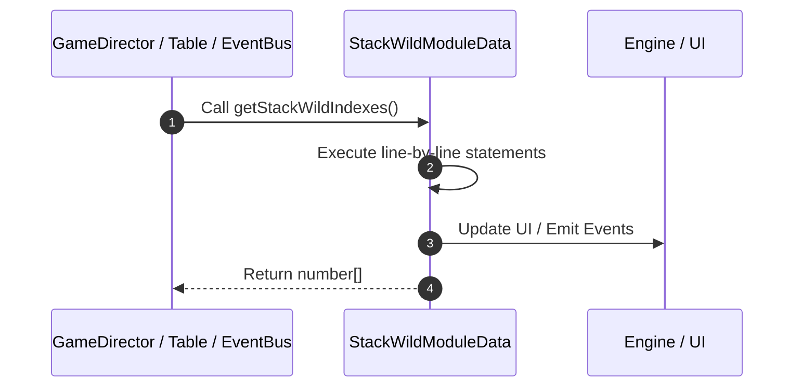

# 📖 `StackWildModuleData.getStackWildIndexes()`

<!-- convention-summary-start -->
### StackWildModuleData.getStackWildIndexes Line-by-Line Method Walkthrough Summary

- **Core Architecture / Purpose**: Technical reference, API contract, and integration guide for StackWildModuleData.getStackWildIndexes Line-by-Line Method Walkthrough.
- **Key Mechanisms & Design**: Encapsulates core algorithms, event hooks, and performance optimizations within the slot framework runtime.
- **Domain Capabilities**: game_implement, 03_methods
- **Scope & Code Paths**: `file:///C:/Users/ADMIN/lamnino/cc20-new-all-in-one/assets/cc-release-slot/cc1-red-cliff/scripts/Table/StackWildModuleData.ts`
- **Related Docs**: [Master Index](../INDEX.md)
<!-- convention-summary-end -->


---

## 1. Method Signature & Overview

```typescript
public getStackWildIndexes(): number[]
```

- **Declaring Class**: `StackWildModuleData` ([`StackWildModuleData.ts`](file:///C:/Users/ADMIN/lamnino/cc20-new-all-in-one/assets/cc-release-slot/cc1-red-cliff/scripts/Table/StackWildModuleData.ts))
- **Source Range**: Lines 79 to 91
- **Execution Cost**: $O(1)$ synchronous logic or timer Promise.

---

## 2. Complete Source Implementation

```typescript
	getStackWildIndexes(): number[] {
		const matrix = this.getRawMatrix();
		const formatMatrix = this.getMegaSymbolsFormatMatrix();

		const { topTableData } = splitTopAndMainTable(matrix, formatMatrix)
		const indices: number[] = [];
		topTableData.forEach((element, index) => {
			if (element === "K2") {
				indices.push(index);
			}
		});
		return indices;
	}
```

---

## 3. Line-by-Line Code Breakdown

| Line # | Code Snippet | Technical Analysis & Engine Behavior |
| :---: | :--- | :--- |
| **79** | `getStackWildIndexes(): number[] {` | Method entry signature declaring `getStackWildIndexes()` returning `number[]`. |
| **80** | `const matrix = this.getRawMatrix();` | Allocates local variable `matrix`. |
| **81** | `const formatMatrix = this.getMegaSymbolsFormatMatrix();` | Allocates local variable `formatMatrix`. |
| **82** | `` | Executes core logic. |
| **83** | `const { topTableData } = splitTopAndMainTable(matrix, formatMatrix)` | Allocates local variable `{ topTableData }`. |
| **84** | `const indices: number[] = [];` | Allocates local variable `indices: number[]`. |
| **85** | `topTableData.forEach((element, index) => {` | Executes core logic. |
| **86** | `if (element === "K2") {` | Conditional guard evaluating branching prerequisite. |
| **87** | `indices.push(index);` | Executes core logic. |
| **88** | `}` | Scope boundary closing block. |
| **89** | `});` | Executes core logic. |
| **90** | `return indices;` | Returns value or promise to calling sequence. |
| **91** | `}` | Scope boundary closing block. |

---

## 4. Execution Call Graph & Sequence


