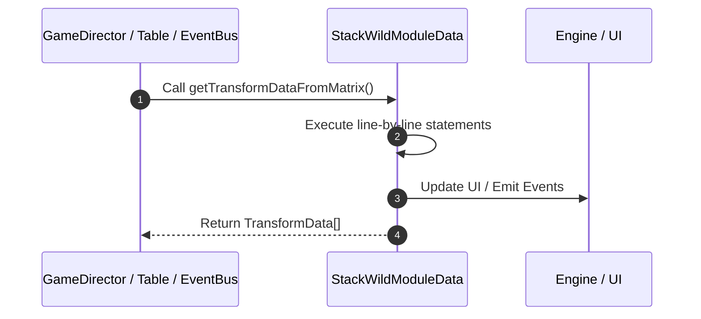

# 📖 `StackWildModuleData.getTransformDataFromMatrix()`

<!-- convention-summary-start -->
### StackWildModuleData.getTransformDataFromMatrix Line-by-Line Method Walkthrough Summary

- **Core Architecture / Purpose**: Technical reference, API contract, and integration guide for StackWildModuleData.getTransformDataFromMatrix Line-by-Line Method Walkthrough.
- **Key Mechanisms & Design**: Encapsulates core algorithms, event hooks, and performance optimizations within the slot framework runtime.
- **Domain Capabilities**: game_implement, 03_methods
- **Scope & Code Paths**: `file:///C:/Users/ADMIN/lamnino/cc20-new-all-in-one/assets/cc-release-slot/cc1-red-cliff/scripts/Table/StackWildModuleData.ts`
- **Related Docs**: [Master Index](../INDEX.md)
<!-- convention-summary-end -->


---

## 1. Method Signature & Overview

```typescript
public getTransformDataFromMatrix(): TransformData[]
```

- **Declaring Class**: `StackWildModuleData` ([`StackWildModuleData.ts`](file:///C:/Users/ADMIN/lamnino/cc20-new-all-in-one/assets/cc-release-slot/cc1-red-cliff/scripts/Table/StackWildModuleData.ts))
- **Source Range**: Lines 93 to 109
- **Execution Cost**: $O(1)$ synchronous logic or timer Promise.

---

## 2. Complete Source Implementation

```typescript
	getTransformDataFromMatrix(): TransformData[] {
		const transformData: TransformData[] = [];
		const matrix0: string[] = this.getMatrix0();
		const matrix: string[] = this.getMatrix();

		if (!matrix0.length || !matrix.length || eno.ArrayUtils.matrixEqual(matrix0, matrix)) {
			return [];
		}

		for (let i = 0; i < matrix.length; i++) {
			if (matrix[i] !== matrix0[i]) {
				transformData.push({ symbolCode: matrix[i], symbolIndex: i });
			}
		}

		return transformData;
	}
```

---

## 3. Line-by-Line Code Breakdown

| Line # | Code Snippet | Technical Analysis & Engine Behavior |
| :---: | :--- | :--- |
| **93** | `getTransformDataFromMatrix(): TransformData[] {` | Method entry signature declaring `getTransformDataFromMatrix()` returning `TransformData[]`. |
| **94** | `const transformData: TransformData[] = [];` | Allocates local variable `transformData: TransformData[]`. |
| **95** | `const matrix0: string[] = this.getMatrix0();` | Allocates local variable `matrix0: string[]`. |
| **96** | `const matrix: string[] = this.getMatrix();` | Allocates local variable `matrix: string[]`. |
| **97** | `` | Executes core logic. |
| **98** | `if (!matrix0.length \|\| !matrix.length \|\| eno.ArrayUtils.matrixEqual(matrix0, matrix)) {` | Conditional guard evaluating branching prerequisite. |
| **99** | `return [];` | Returns value or promise to calling sequence. |
| **100** | `}` | Scope boundary closing block. |
| **101** | `` | Executes core logic. |
| **102** | `for (let i = 0; i < matrix.length; i++) {` | Executes core logic. |
| **103** | `if (matrix[i] !== matrix0[i]) {` | Conditional guard evaluating branching prerequisite. |
| **104** | `transformData.push({ symbolCode: matrix[i], symbolIndex: i });` | Executes core logic. |
| **105** | `}` | Scope boundary closing block. |
| **106** | `}` | Scope boundary closing block. |
| **107** | `` | Executes core logic. |
| **108** | `return transformData;` | Returns value or promise to calling sequence. |
| **109** | `}` | Scope boundary closing block. |

---

## 4. Execution Call Graph & Sequence


