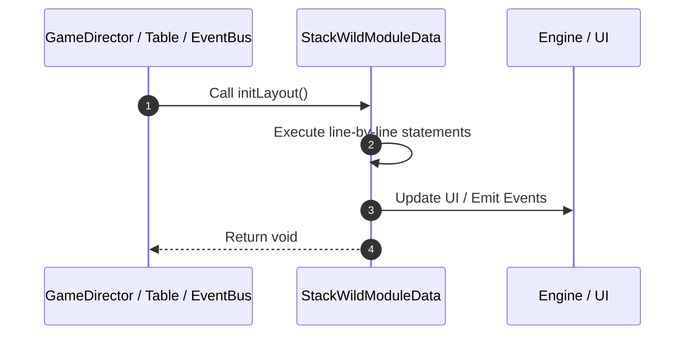

# 📖 `StackWildModuleData.initLayout()`

<!-- convention-summary-start -->
### StackWildModuleData.initLayout Line-by-Line Method Walkthrough Summary

- **Core Architecture / Purpose**: Technical reference, API contract, and integration guide for StackWildModuleData.initLayout Line-by-Line Method Walkthrough.
- **Key Mechanisms & Design**: Encapsulates core algorithms, event hooks, and performance optimizations within the slot framework runtime.
- **Domain Capabilities**: game_implement, 03_methods
- **Scope & Code Paths**: `file:///C:/Users/ADMIN/lamnino/cc20-new-all-in-one/assets/cc-release-slot/cc1-red-cliff/scripts/Table/StackWildModuleData.ts`
- **Related Docs**: [Master Index](../INDEX.md)
<!-- convention-summary-end -->


---

## 1. Method Signature & Overview

```typescript
public initLayout(): void
```

- **Declaring Class**: `StackWildModuleData` ([`StackWildModuleData.ts`](file:///C:/Users/ADMIN/lamnino/cc20-new-all-in-one/assets/cc-release-slot/cc1-red-cliff/scripts/Table/StackWildModuleData.ts))
- **Source Range**: Lines 27 to 47
- **Execution Cost**: $O(1)$ synchronous logic or timer Promise.

---

## 2. Complete Source Implementation

```typescript
	initLayout(): void {
		const cellSize = this._config.cellSize;
		const tableFormat = this._config.TABLE_FORMAT;
		this._positions = [];

		for (let col = 0; col < tableFormat.length; col++) {
			this._positions[col] = [];
			const rowCount = tableFormat[col];

			const tableWidth = tableFormat.length * cellSize.x;
			const tableHeight = rowCount * cellSize.y;
			const offsetX = -tableWidth / 2 + cellSize.x / 2;
			const offsetY = tableHeight / 2 - cellSize.y / 2;

			for (let row = 0; row < rowCount; row++) {
				const x = offsetX + col * cellSize.x;
				const y = offsetY - row * cellSize.y;
				this._positions[col][row] = new cc.Vec2(x, y);
			}
		}
	}
```

---

## 3. Line-by-Line Code Breakdown

| Line # | Code Snippet | Technical Analysis & Engine Behavior |
| :---: | :--- | :--- |
| **27** | `initLayout(): void {` | Method entry signature declaring `initLayout()` returning `void`. |
| **28** | `const cellSize = this._config.cellSize;` | Allocates local variable `cellSize`. |
| **29** | `const tableFormat = this._config.TABLE_FORMAT;` | Allocates local variable `tableFormat`. |
| **30** | `this._positions = [];` | Executes core logic. |
| **31** | `` | Executes core logic. |
| **32** | `for (let col = 0; col < tableFormat.length; col++) {` | Executes core logic. |
| **33** | `this._positions[col] = [];` | Executes core logic. |
| **34** | `const rowCount = tableFormat[col];` | Allocates local variable `rowCount`. |
| **35** | `` | Executes core logic. |
| **36** | `const tableWidth = tableFormat.length * cellSize.x;` | Allocates local variable `tableWidth`. |
| **37** | `const tableHeight = rowCount * cellSize.y;` | Allocates local variable `tableHeight`. |
| **38** | `const offsetX = -tableWidth / 2 + cellSize.x / 2;` | Allocates local variable `offsetX`. |
| **39** | `const offsetY = tableHeight / 2 - cellSize.y / 2;` | Allocates local variable `offsetY`. |
| **40** | `` | Executes core logic. |
| **41** | `for (let row = 0; row < rowCount; row++) {` | Executes core logic. |
| **42** | `const x = offsetX + col * cellSize.x;` | Allocates local variable `x`. |
| **43** | `const y = offsetY - row * cellSize.y;` | Allocates local variable `y`. |
| **44** | `this._positions[col][row] = new cc.Vec2(x, y);` | Executes core logic. |
| **45** | `}` | Scope boundary closing block. |
| **46** | `}` | Scope boundary closing block. |
| **47** | `}` | Scope boundary closing block. |

---

## 4. Execution Call Graph & Sequence


