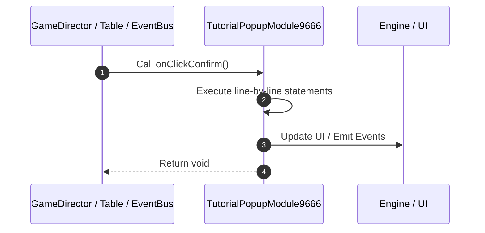

# 📖 `TutorialPopupModule9666.onClickConfirm()`

<!-- convention-summary-start -->
### TutorialPopupModule9666.onClickConfirm Line-by-Line Method Walkthrough Summary

- **Core Architecture / Purpose**: Technical reference, API contract, and integration guide for TutorialPopupModule9666.onClickConfirm Line-by-Line Method Walkthrough.
- **Key Mechanisms & Design**: Encapsulates core algorithms, event hooks, and performance optimizations within the slot framework runtime.
- **Domain Capabilities**: game_implement, 03_methods
- **Scope & Code Paths**: `file:///C:/Users/ADMIN/lamnino/cc20-new-all-in-one/assets/cc-release-slot/cc1-red-cliff/scripts/Gui/TutorialPopupModule9666.ts`
- **Related Docs**: [Master Index](../INDEX.md)
<!-- convention-summary-end -->


---

## 1. Method Signature & Overview

```typescript
public onClickConfirm(): void
```

- **Declaring Class**: `TutorialPopupModule9666` ([`TutorialPopupModule9666.ts`](file:///C:/Users/ADMIN/lamnino/cc20-new-all-in-one/assets/cc-release-slot/cc1-red-cliff/scripts/Gui/TutorialPopupModule9666.ts))
- **Source Range**: Lines 10 to 24
- **Execution Cost**: $O(1)$ synchronous logic or timer Promise.

---

## 2. Complete Source Implementation

```typescript
	onClickConfirm(): void {
		if (this.soundPlayer) {
			this.soundPlayer.playSFXClick();
		}
		this.gameLogic.emit(GameLogicUIEvents.CLOSE_TUTORIAL_POPUP);
		this.gameLogic.emit(GameLogicUIEvents.BACK_TO_REAL_MODE, true);

		const dialogData = this.gameLogic?.getDataModel?.()?.DialogData;
		if (dialogData) {
			dialogData.isOkBtnActive = false;
			dialogData.isCancelBtnActive = false;
			dialogData.message = "Stop Free Play\nYou are in real mode";
			dialogData.active = true;
		}
	}
```

---

## 3. Line-by-Line Code Breakdown

| Line # | Code Snippet | Technical Analysis & Engine Behavior |
| :---: | :--- | :--- |
| **10** | `onClickConfirm(): void {` | Method entry signature declaring `onClickConfirm()` returning `void`. |
| **11** | `if (this.soundPlayer) {` | Conditional guard evaluating branching prerequisite. |
| **12** | `this.soundPlayer.playSFXClick();` | Executes core logic. |
| **13** | `}` | Scope boundary closing block. |
| **14** | `this.gameLogic.emit(GameLogicUIEvents.CLOSE_TUTORIAL_POPUP);` | Executes core logic. |
| **15** | `this.gameLogic.emit(GameLogicUIEvents.BACK_TO_REAL_MODE, true);` | Executes core logic. |
| **16** | `` | Executes core logic. |
| **17** | `const dialogData = this.gameLogic?.getDataModel?.()?.DialogData;` | Allocates local variable `dialogData`. |
| **18** | `if (dialogData) {` | Conditional guard evaluating branching prerequisite. |
| **19** | `dialogData.isOkBtnActive = false;` | Executes core logic. |
| **20** | `dialogData.isCancelBtnActive = false;` | Executes core logic. |
| **21** | `dialogData.message = "Stop Free Play\nYou are in real mode";` | Executes core logic. |
| **22** | `dialogData.active = true;` | Executes core logic. |
| **23** | `}` | Scope boundary closing block. |
| **24** | `}` | Scope boundary closing block. |

---

## 4. Execution Call Graph & Sequence


