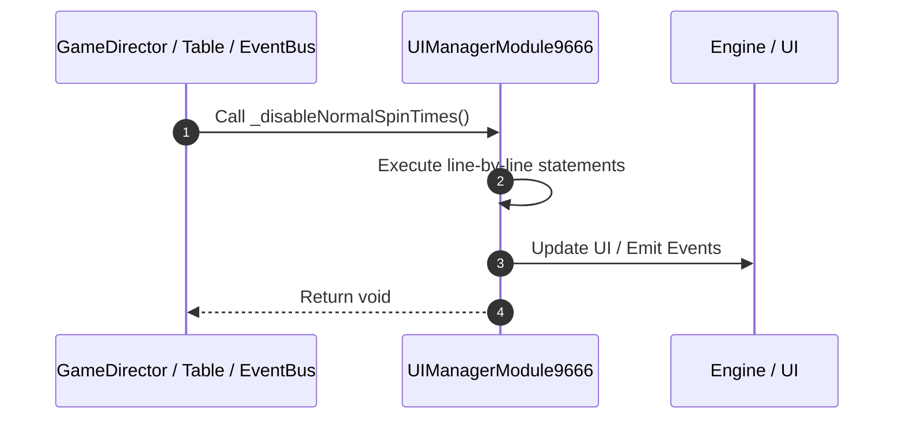

# 📖 `UIManagerModule9666._disableNormalSpinTimes()`

<!-- convention-summary-start -->
### UIManagerModule9666._disableNormalSpinTimes Line-by-Line Method Walkthrough Summary

- **Core Architecture / Purpose**: Technical reference, API contract, and integration guide for UIManagerModule9666._disableNormalSpinTimes Line-by-Line Method Walkthrough.
- **Key Mechanisms & Design**: Encapsulates core algorithms, event hooks, and performance optimizations within the slot framework runtime.
- **Domain Capabilities**: game_implement, 03_methods
- **Scope & Code Paths**: `file:///C:/Users/ADMIN/lamnino/cc20-new-all-in-one/assets/cc-release-slot/cc1-red-cliff/scripts/Gui/UIManagerModule9666.ts`
- **Related Docs**: [Master Index](../INDEX.md)
<!-- convention-summary-end -->


---

## 1. Method Signature & Overview

```typescript
public _disableNormalSpinTimes(): void
```

- **Declaring Class**: `UIManagerModule9666` ([`UIManagerModule9666.ts`](file:///C:/Users/ADMIN/lamnino/cc20-new-all-in-one/assets/cc-release-slot/cc1-red-cliff/scripts/Gui/UIManagerModule9666.ts))
- **Source Range**: Lines 40 to 51
- **Execution Cost**: $O(1)$ synchronous logic or timer Promise.

---

## 2. Complete Source Implementation

```typescript
	private _disableNormalSpinTimes(): void {
		if (!this.normalSpinTimes) return;
		this.normalSpinTimes.active = false;
		const spinTimesModule = this.normalSpinTimes.getComponent(SpinTimesModule);
		if (spinTimesModule) {
			spinTimesModule.updateSpinTimes = () => {
				if (this.normalSpinTimes) {
					this.normalSpinTimes.active = false;
				}
			};
		}
	}
```

---

## 3. Line-by-Line Code Breakdown

| Line # | Code Snippet | Technical Analysis & Engine Behavior |
| :---: | :--- | :--- |
| **40** | `private _disableNormalSpinTimes(): void {` | Method entry signature declaring `_disableNormalSpinTimes()` returning `void`. |
| **41** | `if (!this.normalSpinTimes) return;` | Conditional guard evaluating branching prerequisite. |
| **42** | `this.normalSpinTimes.active = false;` | Executes core logic. |
| **43** | `const spinTimesModule = this.normalSpinTimes.getComponent(SpinTimesModule);` | Allocates local variable `spinTimesModule`. |
| **44** | `if (spinTimesModule) {` | Conditional guard evaluating branching prerequisite. |
| **45** | `spinTimesModule.updateSpinTimes = () => {` | Executes core logic. |
| **46** | `if (this.normalSpinTimes) {` | Conditional guard evaluating branching prerequisite. |
| **47** | `this.normalSpinTimes.active = false;` | Executes core logic. |
| **48** | `}` | Scope boundary closing block. |
| **49** | `};` | Executes core logic. |
| **50** | `}` | Scope boundary closing block. |
| **51** | `}` | Scope boundary closing block. |

---

## 4. Execution Call Graph & Sequence


