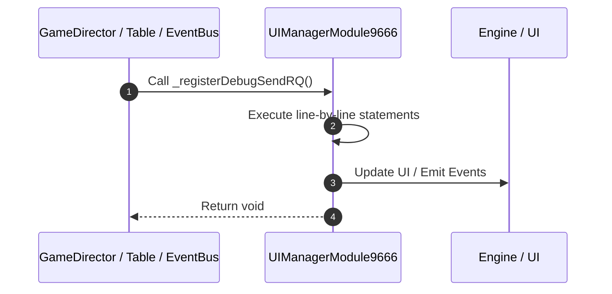

# 📖 `UIManagerModule9666._registerDebugSendRQ()`

<!-- convention-summary-start -->
### UIManagerModule9666._registerDebugSendRQ Line-by-Line Method Walkthrough Summary

- **Core Architecture / Purpose**: Technical reference, API contract, and integration guide for UIManagerModule9666._registerDebugSendRQ Line-by-Line Method Walkthrough.
- **Key Mechanisms & Design**: Encapsulates core algorithms, event hooks, and performance optimizations within the slot framework runtime.
- **Domain Capabilities**: game_implement, 03_methods
- **Scope & Code Paths**: `file:///C:/Users/ADMIN/lamnino/cc20-new-all-in-one/assets/cc-release-slot/cc1-red-cliff/scripts/Gui/UIManagerModule9666.ts`
- **Related Docs**: [Master Index](../INDEX.md)
<!-- convention-summary-end -->


---

## 1. Method Signature & Overview

```typescript
public _registerDebugSendRQ(): void
```

- **Declaring Class**: `UIManagerModule9666` ([`UIManagerModule9666.ts`](file:///C:/Users/ADMIN/lamnino/cc20-new-all-in-one/assets/cc-release-slot/cc1-red-cliff/scripts/Gui/UIManagerModule9666.ts))
- **Source Range**: Lines 66 to 94
- **Execution Cost**: $O(1)$ synchronous logic or timer Promise.

---

## 2. Complete Source Implementation

```typescript
	private _registerDebugSendRQ(): void {
		const gameLogic = this.gameLogic;
		globalThis.sendRQ = (type: string = "ng", arg?: any) => {
			const state = gameLogic.getGameStateManager();
			const t = String(type).toLowerCase();
			switch (t) {
				case "ng": case "n": case "normal": {
					const betId = gameLogic.getBetManager().getBetData().betId;
					state.triggerSpinRequest(betId);
					return `sendRQ normal-spin betId=${betId}`;
				}
				case "f": case "fg": case "free":
					state.triggerFreeSpinRequest();
					return "sendRQ free-spin";
				case "r": case "rg": case "respin":
					state.triggerRespinRequest();
					return "sendRQ respin";
				case "l": case "lightning":
					state.triggerLightningSpinRequest();
					return "sendRQ lightning-spin";
				case "p": case "powerup":
					state.triggerPowerUpSpinRequest(arg);
					return `sendRQ powerup-spin cell=${arg}`;
				default:
					return `sendRQ unknown type "${type}". Use ng|f|r|l|p`;
			}
		};
		cc.log("[debug] globalThis.sendRQ(type) ready: ng|f|r|l|p");
	}
```

---

## 3. Line-by-Line Code Breakdown

| Line # | Code Snippet | Technical Analysis & Engine Behavior |
| :---: | :--- | :--- |
| **66** | `private _registerDebugSendRQ(): void {` | Method entry signature declaring `_registerDebugSendRQ()` returning `void`. |
| **67** | `const gameLogic = this.gameLogic;` | Allocates local variable `gameLogic`. |
| **68** | `globalThis.sendRQ = (type: string = "ng", arg?: any) => {` | Executes core logic. |
| **69** | `const state = gameLogic.getGameStateManager();` | Allocates local variable `state`. |
| **70** | `const t = String(type).toLowerCase();` | Allocates local variable `t`. |
| **71** | `switch (t) {` | Executes core logic. |
| **72** | `case "ng": case "n": case "normal": {` | Executes core logic. |
| **73** | `const betId = gameLogic.getBetManager().getBetData().betId;` | Allocates local variable `betId`. |
| **74** | `state.triggerSpinRequest(betId);` | Executes core logic. |
| **75** | `return `sendRQ normal-spin betId=${betId}`;` | Returns value or promise to calling sequence. |
| **76** | `}` | Scope boundary closing block. |
| **77** | `case "f": case "fg": case "free":` | Executes core logic. |
| **78** | `state.triggerFreeSpinRequest();` | Executes core logic. |
| **79** | `return "sendRQ free-spin";` | Returns value or promise to calling sequence. |
| **80** | `case "r": case "rg": case "respin":` | Executes core logic. |
| **81** | `state.triggerRespinRequest();` | Executes core logic. |
| **82** | `return "sendRQ respin";` | Returns value or promise to calling sequence. |
| **83** | `case "l": case "lightning":` | Executes core logic. |
| **84** | `state.triggerLightningSpinRequest();` | Executes core logic. |
| **85** | `return "sendRQ lightning-spin";` | Returns value or promise to calling sequence. |
| **86** | `case "p": case "powerup":` | Executes core logic. |
| **87** | `state.triggerPowerUpSpinRequest(arg);` | Executes core logic. |
| **88** | `return `sendRQ powerup-spin cell=${arg}`;` | Returns value or promise to calling sequence. |
| **89** | `default:` | Executes core logic. |
| **90** | `return `sendRQ unknown type "${type}". Use ng\|f\|r\|l\|p`;` | Returns value or promise to calling sequence. |
| **91** | `}` | Scope boundary closing block. |
| **92** | `};` | Executes core logic. |
| **93** | `cc.log("[debug] globalThis.sendRQ(type) ready: ng\|f\|r\|l\|p");` | Executes core logic. |
| **94** | `}` | Scope boundary closing block. |

---

## 4. Execution Call Graph & Sequence


