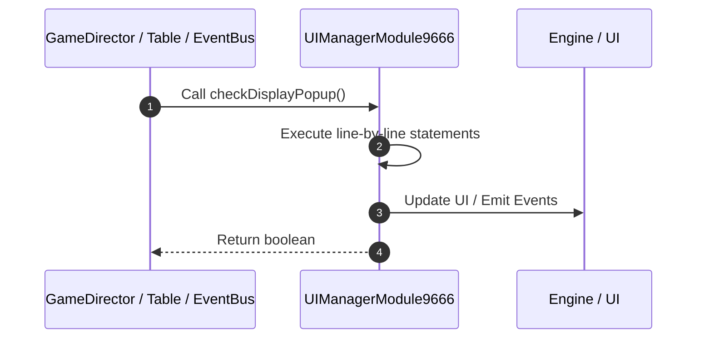

# 📖 `UIManagerModule9666.checkDisplayPopup()`

<!-- convention-summary-start -->
### UIManagerModule9666.checkDisplayPopup Line-by-Line Method Walkthrough Summary

- **Core Architecture / Purpose**: Technical reference, API contract, and integration guide for UIManagerModule9666.checkDisplayPopup Line-by-Line Method Walkthrough.
- **Key Mechanisms & Design**: Encapsulates core algorithms, event hooks, and performance optimizations within the slot framework runtime.
- **Domain Capabilities**: game_implement, 03_methods
- **Scope & Code Paths**: `file:///C:/Users/ADMIN/lamnino/cc20-new-all-in-one/assets/cc-release-slot/cc1-red-cliff/scripts/Gui/UIManagerModule9666.ts`
- **Related Docs**: [Master Index](../INDEX.md)
<!-- convention-summary-end -->


---

## 1. Method Signature & Overview

```typescript
public checkDisplayPopup(): boolean
```

- **Declaring Class**: `UIManagerModule9666` ([`UIManagerModule9666.ts`](file:///C:/Users/ADMIN/lamnino/cc20-new-all-in-one/assets/cc-release-slot/cc1-red-cliff/scripts/Gui/UIManagerModule9666.ts))
- **Source Range**: Lines 53 to 59
- **Execution Cost**: $O(1)$ synchronous logic or timer Promise.

---

## 2. Complete Source Implementation

```typescript
	checkDisplayPopup(): boolean {
		const isDisplay = Boolean(this.popupControl && this.popupControl.isDisplayPopup())
			|| Boolean(this.cutsceneControl && this.cutsceneControl.isDisplayCutscene())
			|| !this.isSpinVisible();
		this.uiManagerData.setDisplayPopup(isDisplay);
		return isDisplay;
	}
```

---

## 3. Line-by-Line Code Breakdown

| Line # | Code Snippet | Technical Analysis & Engine Behavior |
| :---: | :--- | :--- |
| **53** | `checkDisplayPopup(): boolean {` | Method entry signature declaring `checkDisplayPopup()` returning `boolean`. |
| **54** | `const isDisplay = Boolean(this.popupControl && this.popupControl.isDisplayPopup())` | Allocates local variable `isDisplay`. |
| **55** | `\|\| Boolean(this.cutsceneControl && this.cutsceneControl.isDisplayCutscene())` | Executes core logic. |
| **56** | `\|\| !this.isSpinVisible();` | Executes core logic. |
| **57** | `this.uiManagerData.setDisplayPopup(isDisplay);` | Executes core logic. |
| **58** | `return isDisplay;` | Returns value or promise to calling sequence. |
| **59** | `}` | Scope boundary closing block. |

---

## 4. Execution Call Graph & Sequence


