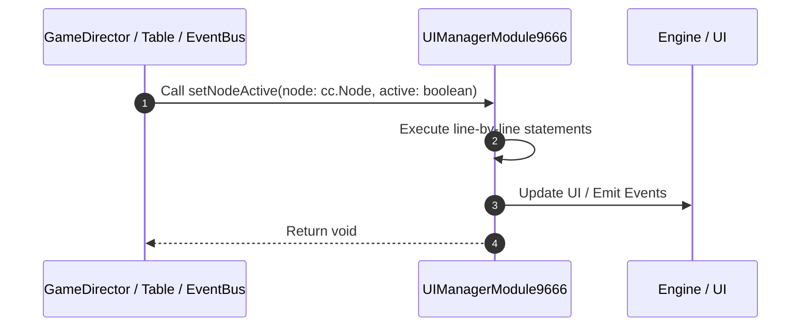

# 📖 `UIManagerModule9666.setNodeActive()`

<!-- convention-summary-start -->
### UIManagerModule9666.setNodeActive Line-by-Line Method Walkthrough Summary

- **Core Architecture / Purpose**: Technical reference, API contract, and integration guide for UIManagerModule9666.setNodeActive Line-by-Line Method Walkthrough.
- **Key Mechanisms & Design**: Encapsulates core algorithms, event hooks, and performance optimizations within the slot framework runtime.
- **Domain Capabilities**: game_implement, 03_methods
- **Scope & Code Paths**: `file:///C:/Users/ADMIN/lamnino/cc20-new-all-in-one/assets/cc-release-slot/cc1-red-cliff/scripts/Gui/UIManagerModule9666.ts`
- **Related Docs**: [Master Index](../INDEX.md)
<!-- convention-summary-end -->


---

## 1. Method Signature & Overview

```typescript
public setNodeActive(node: cc.Node, active: boolean): void
```

- **Declaring Class**: `UIManagerModule9666` ([`UIManagerModule9666.ts`](file:///C:/Users/ADMIN/lamnino/cc20-new-all-in-one/assets/cc-release-slot/cc1-red-cliff/scripts/Gui/UIManagerModule9666.ts))
- **Source Range**: Lines 27 to 33
- **Execution Cost**: $O(1)$ synchronous logic or timer Promise.

---

## 2. Complete Source Implementation

```typescript
	setNodeActive(node: cc.Node, active: boolean): void {
		if (node && node === this.normalSpinTimes) {
			super.setNodeActive(node, false);
			return;
		}
		super.setNodeActive(node, active);
	}
```

---

## 3. Line-by-Line Code Breakdown

| Line # | Code Snippet | Technical Analysis & Engine Behavior |
| :---: | :--- | :--- |
| **27** | `setNodeActive(node: cc.Node, active: boolean): void {` | Method entry signature declaring `setNodeActive(node: cc.Node, active: boolean)` returning `void`. |
| **28** | `if (node && node === this.normalSpinTimes) {` | Conditional guard evaluating branching prerequisite. |
| **29** | `super.setNodeActive(node, false);` | Delegates to parent superclass lifecycle implementation. |
| **30** | `return;` | Returns value or promise to calling sequence. |
| **31** | `}` | Scope boundary closing block. |
| **32** | `super.setNodeActive(node, active);` | Delegates to parent superclass lifecycle implementation. |
| **33** | `}` | Scope boundary closing block. |

---

## 4. Execution Call Graph & Sequence


