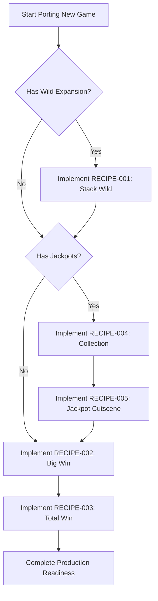

# 📚 ARK Slot Feature Recipes Directory (`02_feature_recipes`)

<!-- convention-summary-start -->
### ARK Slot Feature Recipes Master Summary

- **Core Architecture / Purpose**: Master index and technical catalog of production-verified feature recipes for porting Vendor SDK games to ARK business standards.
- **Key Mechanisms & Design**: Standardized modular documentation, subclassing recipes, state machines, Spine bone sync coordinates, sound cross-fade, and reconnection recovery.
- **Domain Capabilities**: feature, 02_feature_recipes
- **Scope & Code Paths**: `assets/cc-release-slot/cc1-red-cliff/scripts/`
<!-- convention-summary-end -->

---

## 🎯 Overview & Architectural Philosophy

When porting or developing slot games on top of the base Vendor SDK (`cc-common`, `cc-slot-module`), core business features must adhere to **zero direct edits in vendor packages**. Every recipe in this catalog encapsulates an architectural pattern that overrides or extends vendor behavior through clean subclassing, event-bus hooks, and production-tested state machines.

All recipes are structured into self-contained modular subdirectories containing:
1. **Overview & Requirements**: Problem analysis, visual targets, and SDK discrepancy.
2. **Architecture & State Machine**: Sequence diagrams, event triggers, and lifecycle stages.
3. **Spine & Bone Sync**: Real-time bone coordinate tracking and event bindings.
4. **Input & Edge Cases**: Touch/Spacebar debounced skipping, turbo mode, and reconnection rollback.
5. **Full Source Code**: Complete, copy-paste ready TypeScript source code.
6. **Gotchas & Traps**: Known runtime edge cases and production fixes.
7. **Reusability & Setup Guide**: Step-by-step developer checklist for node hierarchy, inspector mappings, and QA.

---

## 📋 Production Recipes Catalog

| Recipe ID | Feature Title | Target Directory | Primary Target Modules | Status |
| :--- | :--- | :--- | :--- | :--- |
| [**RECIPE-001**](./RECIPE_001_custom_stack_wild_reel_expansion_pattern.md) | **Custom Stack Wild Reel Expansion & Replacement** | Single Doc | `SlotReelModule`, `SlotTableModule`, `SlotSymbolManager` | `VERIFIED` |
| [**RECIPE-002**](./RECIPE_002_multi_milestone_big_win_celebration_spine_sync/INDEX.md) | **Multi-Milestone Big Win Celebration Spine Sync** | [Directory](./RECIPE_002_multi_milestone_big_win_celebration_spine_sync/) | `WinEffectComponent`, `BigWinModule`, `BaseCutscene` | `VERIFIED` |
| [**RECIPE-003**](./RECIPE_003_total_win_celebration_spine_sync/INDEX.md) | **Total Win Celebration with 3-Stage Spine Sync** | [Directory](./RECIPE_003_total_win_celebration_spine_sync/) | `TotalWinModule`, `FreeGameDirectorModule` | `VERIFIED` |
| [**RECIPE-004**](./RECIPE_004_jackpot_collection_system/INDEX.md) | **Jackpot Collection System** | [Directory](./RECIPE_004_jackpot_collection_system/) | `JackpotCollectionModule`, `JackpotCollectionItem`, `JackpotCollectionData` | `VERIFIED` |
| [**RECIPE-005**](./RECIPE_005_jackpot_win_celebration_cutscene/INDEX.md) | **Jackpot Win Celebration Cutscene** | [Directory](./RECIPE_005_jackpot_win_celebration_cutscene/) | `JackpotWinModule`, `CutsceneController` | `VERIFIED` |

---

## 🏗️ Recipe Implementation Matrix for New Games

When bootstrapping a new slot project (`cc-release-slot/<new_game_id>`), follow this integration checklist:

---

## 🔗 Related Documentation & Standards

- **[Convention & Authoring Rules](../CONVENTION.md)**: Standard 7-section template and frontmatter guidelines.
- **[Bugs & Gotchas Index](../01_bugs_and_gotchas/)**: Known SDK quirks, Spine memory traps, and timing bugs.
- **[Business Mappings](../03_business_mappings/)**: Server protocol differences, Bet multipliers, and denomination contracts.
