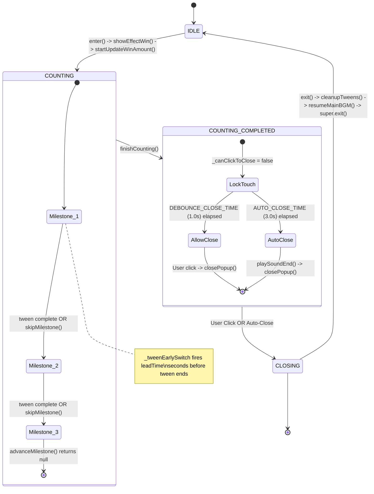

# 2. 🔄 State Machine & Lifecycle Flow

<!-- convention-summary-start -->
### Multi-Milestone Big Win - State Machine & Lifecycle Flow Summary

- **Core Architecture / Purpose**: Đặc tả 4-state machine (`IDLE` → `COUNTING` → `COUNTING_COMPLETED` → `CLOSING`), toàn bộ lifecycle methods, luồng sequence từ Director đến Spine đến Sound, cùng các rule cho touch/keyboard skip.
- **Key Mechanisms & Design**: `WinEffectData9666` lưu state; `moveToNextMilestone` có `forceTargetLevel` và `_tweenEarlySwitch`; `triggerMoneyCount` có guard; spacebar support qua `onEnable`/`onDisable`.
- **Domain Capabilities**: feature, RECIPE_002_multi_milestone_big_win_celebration_spine_sync
- **Scope & Code Paths**: `assets/cc-release-slot/cc1-red-cliff/scripts/Cutscene/`
- **Related Docs**: [Master Index](./INDEX.md)
<!-- convention-summary-end -->


---

## 2.1 State Machine Specification

```typescript
export enum WinPopupState {
    IDLE = 0,               // Popup closed, uninitialized
    COUNTING = 1,           // Active money count-up tween in progress
    COUNTING_COMPLETED = 2, // Counting finished, in 1.0s debounce or 3.0s auto-close
    CLOSING = 3             // Teardown in progress, resolving callback
}
```

> State được lưu trong `WinEffectData9666.popupState`, truy cập qua `this._popupState` (getter/setter).



---

## 2.2 Sequence Diagram of Full Celebration Flow

```mermaid
sequenceDiagram
    autonumber
    participant D as Director / Writer
    participant CC as CutsceneController
    participant W as WinEffectModule9666
    participant Sp as Spine Skeleton
    participant Snd as SoundPlayer

    D->>CC: PLAY_CUTSCENE (BIG_WIN, winAmount, totalBet)
    CC->>W: play(content, callback)
    W->>W: enter() - check Turbo/FTR
    Note over W: isTurboActive || isFastToResult?
    alt Turbo / Fast-To-Result
        W->>Snd: _duckCurrentBgm() + playSfx(SOUND_SHORTEN)
        W->>W: showFastEffectWin() -> super
        W-->>CC: callback resolved immediately
    else Normal Mode
        W->>W: showEffectWin()
        W->>Snd: switchMusicWithFade(BGM_BIGWIN, true)
        W->>W: initValue() -> winData.setupMilestones()
        W->>W: changeTitle(level=0) -> playLevelAnim(0)
        W->>Sp: setAnimation(0, win_1_in, false)
        W->>Sp: setEventListener(slot_money event -> triggerMoneyCount)
        W->>Sp: setCompleteListener(-> triggerMoneyCount + loop anim)
        W->>W: scheduleOnce(triggerMoneyCount, INTRO_DELAY) backup

        Sp-->>W: [Spine Event: slot_money fires]
        W->>W: triggerMoneyCount() [guard: once only]
        W->>W: fadeInWinAmount() + startParticle()
        W->>Snd: playSoundCounting() [loop SFX every 1.5s]
        W->>W: moveToNextMilestone()

    W->>W: finishCounting()
    W->>Snd: playSfx('BIGWIN_END')
    W->>W: Start 1.0s Debounce (_canClickToClose = false)
    W->>W: Start 3.0s Auto-Close Timer

    alt User Taps After 1.0s Debounce
        User->>W: onClick()
        W->>W: closePopup() -> exit()
    else 3.0s Auto-Close Timer Expires
        W->>W: closePopup() -> exit()
    end

    W->>Snd: resumeMainBGM()
    W->>CC: callback() [Resolves Promise]
    CC-->>D: Big Win Cutscene Finished
```

---

## 2.3 Interactive Touch Rules
1. **Click Throttling**:
   - `now - this._lastClickTime < 300ms`: Ignored to prevent rapid-fire multi-touch gestures from glitching tweens.
2. **During `COUNTING`**:
   - Tapping immediately jumps current display value to `currentMilestone.targetAmount`.
   - Advances to next milestone if available, or immediately calls `finishCounting()`.
3. **During `COUNTING_COMPLETED`**:
   - First **1.0 second**: `_canClickToClose = false`. Taps are ignored to protect against accidental tap-throughs.
   - After **1.0 second**: `_canClickToClose = true`. Tapping instantly closes the popup.
   - After **3.0 seconds**: Auto-close executes if no player interaction occurs.
