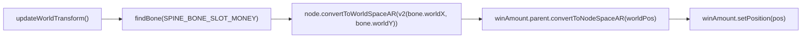

# 3. 🦴 Dynamic Spine Bone Tracking & Sync

<!-- convention-summary-start -->
### Multi-Milestone Big Win - Spine Bone Tracking & Sync Summary

- **Core Architecture / Purpose**: World-space bone tracking cho win amount label; `playLevelAnim` lifecycle với Spine Event–driven counting trigger; animation listener teardown pattern; `initSkeletonMix` crossfade setup.
- **Key Mechanisms & Design**: `syncMoneyToSlot()` gọi `updateWorldTransform()` trước mỗi `findBone()`. `update()` sync liên tục khi `COUNTING`/`COUNTING_COMPLETED` + skeleton active. Spine Event `slot_money` trigger counting, `completeListener` fallback. Conditional track reset (chỉ reset nếu `levelIndex === 0` hoặc không có track).
- **Domain Capabilities**: feature, RECIPE_002_multi_milestone_big_win_celebration_spine_sync
- **Scope & Code Paths**: `assets/cc-release-slot/cc1-red-cliff/scripts/Cutscene/`
- **Related Docs**: [Master Index](./INDEX.md)
<!-- convention-summary-end -->


---

## 3.1 The Coordinate Space Challenge
Trong slot animations, victory characters thường jump, bounce, hoặc shake win board. Nếu win amount label được đặt static tại `(0, 0)`, nó sẽ trông disconnected và float unnaturally.

### The Problem:
- Spine bones tính toán positions trong **Spine local space**.
- UI Labels nằm trong **Node / Canvas space**.
- Nếu parent nodes có scaling, resolution adaptation, hoặc offsets, copy trực tiếp position tạo ra severe coordinate misalignments.

---

## 3.2 Bone Tracking Algorithm



### Implementation (actual code):
```typescript
syncMoneyToSlot(): void {
    if (!this.bigWinSkeleton || !this.bigWinSkeleton.skeletonData || !this.winAmount || !this.winAmount.parent) {
        return;
    }

    // 1. Force skeleton to update world transformation matrices for current frame
    this.bigWinSkeleton.updateWorldTransform();

    // 2. Find the designated anchor bone (name từ WinEffectConfig9666.SPINE_BONE_SLOT_MONEY)
    const bone = this.bigWinSkeleton.findBone(WinEffectConfig9666.SPINE_BONE_SLOT_MONEY);
    if (!bone) {
        return;
    }

    // 3. Transform bone local coords to Cocos World Space
    const worldPos = this.bigWinSkeleton.node.convertToWorldSpaceAR(cc.v2(bone.worldX, bone.worldY));

    // 4. Transform World Space coords into label parent's local space
    this.winAmount.setPosition(this.winAmount.parent.convertToNodeSpaceAR(worldPos));
}
```

> **Critical**: `SPINE_BONE_SLOT_MONEY` là constant string trong `WinEffectConfig9666` (thường là `"slot_money"`). Không hardcode string trực tiếp.

---

## 3.3 Continuous Sync trong `update()`

```typescript
update(_dt: number): void {
    // Sync mỗi frame khi COUNTING hoặc COUNTING_COMPLETED VÀ skeleton đang active
    if ((this._popupState === WinPopupState.COUNTING || this._popupState === WinPopupState.COUNTING_COMPLETED)
        && this.bigWinSkeleton && this.bigWinSkeleton.node.active) {
        this.syncMoneyToSlot();
    }
}
```

> **Khác với docs cũ**: Trước đây `update()` chỉ sync khi `_isMoneySlotMoving === true`. Hiện tại sync theo state-based condition (COUNTING hoặc COUNTING_COMPLETED) + node.active. `_isMoneySlotMoving` vẫn tồn tại để các nơi khác check, nhưng không còn là điều kiện duy nhất của `update()`.

---

## 3.4 Spine Track & Animation Management trong `playLevelAnim`

```typescript
playLevelAnim(levelIndex: number): void {
    if (!this.bigWinSkeleton || !this.bigWinSkeleton.skeletonData) {
        // Fallback: nếu không có Spine, vẫn trigger counting để flow không bị chặn
        this.triggerMoneyCount();
        return;
    }

    const inAnim = WinEffectConfig9666.getInAnim(levelIndex);
    const loopAnim = WinEffectConfig9666.getLoopAnim(levelIndex);

    this.bigWinSkeleton.node.active = true;
    const currentTrack = this.bigWinSkeleton.getCurrent(0);

    // Chỉ reset hoàn toàn khi level 0 (đầu tiên) hoặc chưa có track nào
    // Các level cao hơn sử dụng Spine mix để chuyển mượt
    if (!currentTrack || levelIndex === 0) {
        this.bigWinSkeleton.clearTracks();
        this.bigWinSkeleton.setToSetupPose();
    }

    // Bắt đầu entrance animation
    this.bigWinSkeleton.setAnimation(0, inAnim, false);
    this._isMoneySlotMoving = true;
    this.syncMoneyToSlot();

    // Spine Event: "slot_money" → triggerMoneyCount()
    this.bigWinSkeleton.setEventListener((_trackEntry: any, event: any) => {
        const eventName = event?.data?.name;
        if (eventName === this.eventNameMoneyCount) {
            this.triggerMoneyCount();
        }
    });

    // Fallback: khi intro anim hoàn thành → trigger counting + chuyển sang loop
    this.bigWinSkeleton.setCompleteListener((trackEntry: any) => {
        if (trackEntry && trackEntry.animation && trackEntry.animation.name === inAnim) {
            // One-shot clear để tránh stale callback
            this.bigWinSkeleton.setCompleteListener(() => { });
            this._isMoneySlotMoving = false;
            this.triggerMoneyCount();   // fallback trigger counting
            this.syncMoneyToSlot();
            this.bigWinSkeleton.setAnimation(0, loopAnim, true);
        }
    });
}
```

### Dual Trigger Mechanism cho `triggerMoneyCount()`:
| Cơ chế | Khi nào fire | Ưu tiên |
|:---|:---|:---|
| **Spine Event** `slot_money` | Khi Spine animator fire event trong intro anim | Ưu tiên (sớm hơn) |
| **`completeListener`** | Khi intro anim kết thúc hoàn toàn | Fallback |
| **`scheduleOnce(INTRO_DELAY)`** | Sau `INTRO_DELAY` giây từ `showEffectWin()` | Last resort backup |

`_hasTriggeredMoneyCount` guard đảm bảo chỉ có một trong ba cơ chế thực sự chạy.

---

## 3.5 Spine Mix Configuration

```typescript
private initSkeletonMix(): void {
    if (!this.bigWinSkeleton || !this.bigWinSkeleton.skeletonData) return;
    const dur = WinEffectConfig9666.SPINE_MIX_DURATION;  // typically 0.2s
    for (const [fromAnim, toAnim] of WinEffectConfig9666.SPINE_MIX_PAIRS) {
        this.bigWinSkeleton.setMix(fromAnim, toAnim, dur);
    }
}
```

`WinEffectConfig9666.SPINE_MIX_PAIRS` chứa tất cả cặp `[fromAnim, toAnim]` cần crossfade. Ví dụ:
```typescript
// Trong WinEffectConfig9666:
static SPINE_MIX_PAIRS: [string, string][] = [
    ['win_1_in', 'win_1_loop'],
    ['win_2_in', 'win_2_loop'],
    ['win_3_in', 'win_3_loop'],
    // ... more pairs
];
static SPINE_MIX_DURATION = 0.2;
```

---

## 3.6 Animation State trong `finishCounting()`

```typescript
// Trong finishCounting() - đảm bảo loop anim đúng đang chạy
if (this.bigWinSkeleton && this.bigWinSkeleton.skeletonData) {
    const loopAnim = WinEffectConfig9666.getLoopAnim(this._currentTitle);
    const currentTrack = this.bigWinSkeleton.getCurrent(0);
    // Chỉ switch nếu chưa đang chạy đúng loop anim
    if (!currentTrack || currentTrack.animation.name !== loopAnim) {
        this.bigWinSkeleton.setCompleteListener(() => { });  // clear stale listener
        this.bigWinSkeleton.setAnimation(0, loopAnim, true);
        this.syncMoneyToSlot();
    }
}
```

`_currentTitle` được set bởi `winData.getTrueFinalLevel()` — level cao nhất thực sự đã được unlock theo totalWinAmount.

---

## 3.7 Teardown / Cleanup Pattern

```typescript
// Trong exit() và showFastEffectWin() và onDestroy():
if (this.bigWinSkeleton) {
    this._isMoneySlotMoving = false;
    this.bigWinSkeleton.setCompleteListener(() => { });  // noop để tránh stale fire
    this.bigWinSkeleton.setEventListener(null);           // clear event listener
    this.bigWinSkeleton.clearTracks();
    this.bigWinSkeleton.node.active = false;
}
```

> **Critical**: Phải gọi cả `setCompleteListener(noop)` VÀ `setEventListener(null)`. Bỏ sót một trong hai sẽ dẫn đến stale callback fire sau khi popup đã đóng.

---

## 3.8 Animation Naming Convention

Animation names được resolve qua static methods của `WinEffectConfig9666`:
```typescript
WinEffectConfig9666.getInAnim(levelIndex)   // e.g. "win_1_in" cho levelIndex=0
WinEffectConfig9666.getLoopAnim(levelIndex) // e.g. "win_1_loop" cho levelIndex=0
```

Spine Animator phải cung cấp bones và animations theo convention:
| Asset | Quy tắc |
|:---|:---|
| Bone | Đặt tên đúng `SPINE_BONE_SLOT_MONEY` (từ `WinEffectConfig9666`) |
| Spine Event | Tên event phải khớp `eventNameMoneyCount` property (default: `"slot_money"`) |
| Intro Anims | `getInAnim(0)` → `getInAnim(N)` cho từng level |
| Loop Anims | `getLoopAnim(0)` → `getLoopAnim(N)` cho từng level |
