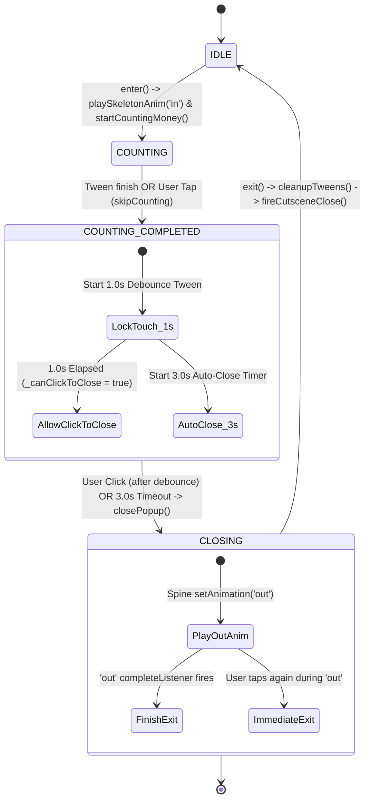
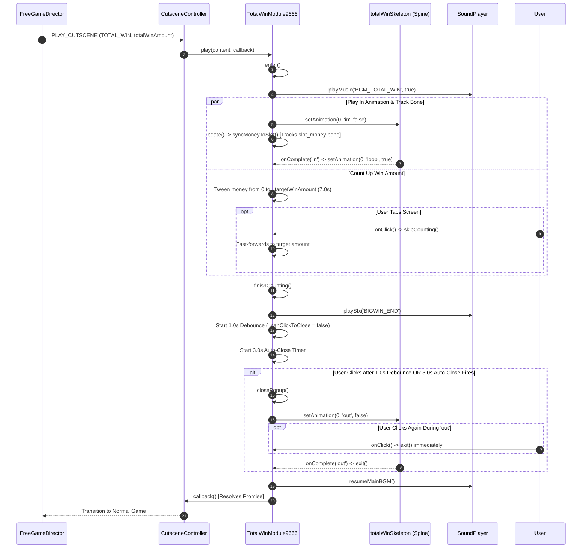

# 2. 🔄 State Machine & Lifecycle Flow

<!-- convention-summary-start -->
### Total Win Celebration - State Machine & Lifecycle Flow Summary

- **Core Architecture / Purpose**: Technical reference, API contract, and integration guide for Total Win Celebration - State Machine & Lifecycle Flow.
- **Key Mechanisms & Design**: Encapsulates core algorithms, event hooks, and performance optimizations within the slot framework runtime.
- **Domain Capabilities**: feature, RECIPE_003_total_win_celebration_spine_sync
- **Scope & Code Paths**: `assets/cc-release-slot/cc1-red-cliff/scripts/`
- **Related Docs**: [Master Index](../INDEX.md)
<!-- convention-summary-end -->


---

## 2.1 State Machine Specification

```typescript
enum TotalWinState {
    IDLE = 0,               // Uninitialized, inactive
    COUNTING = 1,           // Spine 'in' playing, money count tween running
    COUNTING_COMPLETED = 2, // Spine 'loop' playing, 1.0s debounce & 3.0s auto-close
    CLOSING = 3             // Spine 'out' playing, preparing to resolve callback
}
```



---

## 2.2 Sequence Diagram



---

## 2.3 Interactive Touch Rules (`onClick`)

```typescript
public onClick(): void {
    if (this._popupState === TotalWinState.COUNTING) {
        // 1. Skip count-up immediately to target amount
        this.playSoundSkip();
        this.skipCounting();
    } else if (this._popupState === TotalWinState.COUNTING_COMPLETED) {
        // 2. Trigger 'out' transition if 1.0s debounce has elapsed
        if (this._canClickToClose) {
            this.closePopup();
        }
    } else if (this._popupState === TotalWinState.CLOSING) {
        // 3. User taps during 'out' animation -> force instant exit
        this.exit();
    }
}
```
