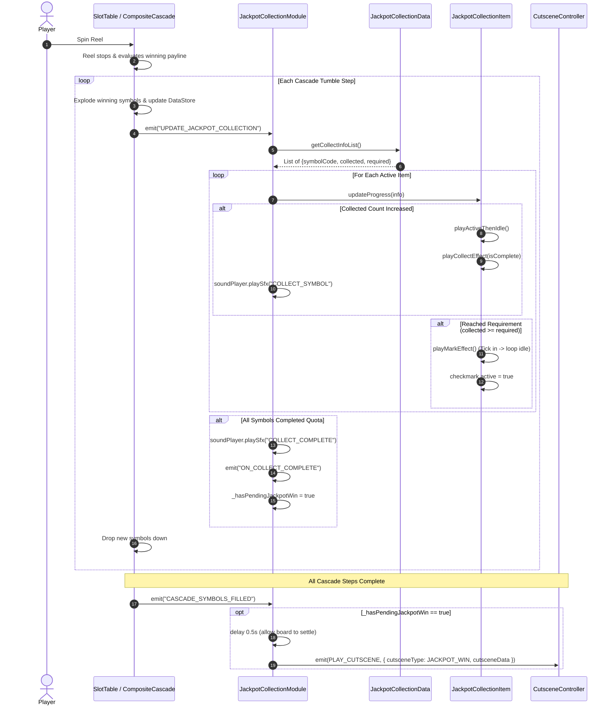

# 2. 🏛️ Architecture & Data Flow

<!-- convention-summary-start -->
### Jackpot Collection - Architecture & Data Flow Summary

- **Core Architecture / Purpose**: Detailed breakdown of the 4-tier modular design and runtime event dispatch flow during reel cascades.
- **Key Mechanisms & Design**: Decoupling visual rendering from data storage, event triggers from `CompositeCascade`, and queueing pending jackpot cutscene triggers.
- **Domain Capabilities**: feature, RECIPE_004_jackpot_collection_system
- **Scope & Code Paths**: `assets/cc-release-slot/cc1-red-cliff/scripts/Gui/`
- **Related Docs**: [01. Overview](./01_overview_and_problem.md), [03. Visual Choreography](./03_item_visual_and_tick_choreography.md)
<!-- convention-summary-end -->

---

## 2.1 4-Tier Component Architecture

The feature is intentionally separated into four distinct, single-responsibility components to allow 100% plug-and-play reuse across any slot theme:

```text
┌─────────────────────────────────────────────────────────────┐
│ 1. JackpotCollectionConfig (Inspector Configuration)        │
│    - Maps symbol codes (e.g. '3', '4', '5') to Spine assets.│
└──────────────────────────────┬──────────────────────────────┘
                               │
┌──────────────────────────────▼──────────────────────────────┐
│ 2. JackpotCollectionData (Data Store Layer)                 │
│    - Extends BaseDataModule.                                │
│    - Parses raw server string: ["SYM:current:required"].    │
│    - Exposes getCollectInfoList() & getJackpotInfo().       │
└──────────────────────────────┬──────────────────────────────┘
                               │
┌──────────────────────────────▼──────────────────────────────┐
│ 3. JackpotCollectionModule (Controller Layer)               │
│    - Extends SlotBaseModule.                                │
│    - Manages item lifecycle and instantiation.              │
│    - Handles UPDATE_JACKPOT_COLLECTION & CASCADE_FILLED.    │
│    - Plays SFX and triggers Jackpot Cutscene.               │
└──────────────────────────────┬──────────────────────────────┘
                               │
┌──────────────────────────────▼──────────────────────────────┐
│ 4. JackpotCollectionItem (Visual Presentation Layer)        │
│    - Extends cc.Component.                                  │
│    - Renders Spine character, count label, collect burst.   │
│    - Executes the Checkmark Tick IN -> IDLE animation.      │
└─────────────────────────────────────────────────────────────┘
```

---

## 2.2 Sequence Diagram: Cascade Explosion to Cutscene Handover



---

## 2.3 Key Architectural Principles

1. **Cascade Decoupling**: The cascade logic (`CompositeCascade`) does not need to know anything about Jackpot rules or Spine animations; it merely fires `UPDATE_JACKPOT_COLLECTION` after updating the payline score, and `CASCADE_SYMBOLS_FILLED` when grid drops finish.
2. **Pending Cutscene Pattern**: Never launch the cutscene synchronously mid-cascade! If the 2nd tumble completes the collection, subsequent cascade tumbles must continue rendering so the player sees the full tumble win. The cutscene is queued in `_hasPendingJackpotWin` and waits for `CASCADE_SYMBOLS_FILLED`.
