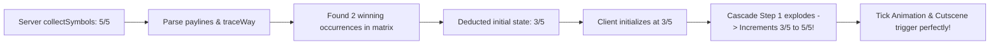

# 4. 🔄 Reconnection & Backward Deduction Algorithm

<!-- convention-summary-start -->
### Jackpot Collection - Reconnection & Backward Deduction Summary

- **Core Architecture / Purpose**: Detailed analysis of the server packet desync during reconnection and the backward deduction algorithm used to restore state before cascade animation.
- **Key Mechanisms & Design**: Parses `freeGamePayLines`, `matrix`, and `traceWay` from `dataResume` to calculate and subtract current spin winning symbol counts from server `collectSymbols`.
- **Domain Capabilities**: feature, RECIPE_004_jackpot_collection_system
- **Scope & Code Paths**: `assets/cc-release-slot/cc1-red-cliff/scripts/Gui/JackpotCollectionModule9666.ts`
- **Related Docs**: [02. Architecture & Data Flow](./02_architecture_and_data_flow.md), [05. Full Implementation Code](./05_full_implementation_code.md)
<!-- convention-summary-end -->

---

## 4.1 The Reconnection Dilemma

In backend server architectures:
- When a spin request is processed, the server calculates the **entire cascade sequence at once**.
- The server updates the database session with the **final `collectSymbols` value** immediately.
- If the player refreshes the browser (F5) or loses internet during step 1 of a 4-step cascade:
  1. The server returns `joinGameData.dataResume` containing the final `collectSymbols` (e.g., symbol `A: 5:5`).
  2. If the client initializes directly with `5/5`, the player will see a completed tick mark before the winning symbols even explode on screen!
  3. Worse, when the cascade step replays and fires `UPDATE_JACKPOT_COLLECTION`, the client won't detect an increment (`collected > prevCollected`), so **no collection animations or tick celebrations will play**.

---

## 4.2 The Mathematical Backward Deduction

To solve this, the client on `JOIN_GAME_SUCCESS` calculates:

$$\text{Initial Count on Client} = \max(0, \text{Server Final Count} - \text{Winning Counts in Current Spin})$$



---

## 4.3 Implementation Code in `JackpotCollectionModule`

```typescript
private onJoinGameSuccess(data: any): void {
    const joinGameData = data?.joinGameData;
    const resumeData = joinGameData?.dataResume || data?.dataResume;
    const rawList = resumeData?.collectSymbols || joinGameData?.collectSymbols;

    if (!rawList) return;

    const paylines = resumeData?.freeGamePayLines || resumeData?.paylines || resumeData?.normalGamePayLines;
    if (resumeData && paylines && paylines.length > 0) {
        const paylineCounts: Record<string, number> = {};
        const parsedPaylines = eno.SlotUtils?.convertPayLineAllWays 
            ? eno.SlotUtils.convertPayLineAllWays(paylines) 
            : paylines;
        const winningSymbolIds = new Set<string>();

        // 1. Collect all winning symbol IDs
        for (const pl of parsedPaylines) {
            const sym = pl.symbolId || pl.symbolName || pl.symbolCode || pl.symbol;
            if (sym) {
                winningSymbolIds.add(String(sym).trim());
            }
        }

        const rawMatrix = resumeData.freeGameMatrix || resumeData.normalGameMatrix || resumeData.matrix || [];
        const traceWay: number[] = resumeData.traceWay || [];

        // 2. Count exact winning symbol occurrences across traceWay
        winningSymbolIds.forEach((symId) => {
            let count = 0;
            if (traceWay && traceWay.length > 0 && rawMatrix.length > 0) {
                traceWay.forEach((idx: number) => {
                    const sym = rawMatrix[idx];
                    if (sym) {
                        const cleanSym = String(sym).split('_')[0];
                        // Support Wild substitution (e.g. prefix 'K')
                        if (cleanSym === symId || cleanSym.startsWith('K')) {
                            count++;
                        }
                    }
                });
            }

            // Fallback: estimate from payline reel counts
            if (count === 0) {
                for (const pl of parsedPaylines) {
                    const sym = String(pl.symbolId || pl.symbolName || pl.symbolCode || '').trim();
                    if (sym === symId) {
                        count += (pl.reelCount || 1);
                    }
                }
            }
            paylineCounts[symId] = count;
        });

        // 3. Subtract win count to calculate pre-spin state
        const adjustedList = rawList.map((item: string) => {
            if (typeof item !== 'string') return item;
            const parts = item.split(':');
            if (parts.length >= 3) {
                const symbolCode = parts[0];
                const collected = parseInt(parts[1], 10) || 0;
                const required = parseInt(parts[2], 10) || 0;
                const currentWinCount = paylineCounts[symbolCode] || 0;
                const beforeCollect = Math.max(0, collected - currentWinCount);
                return `${symbolCode}:${beforeCollect}:${required}`;
            }
            return item;
        });

        this.initItems(adjustedList);
        return;
    }

    // Normal initialization if no active payline resume
    this.initItems(rawList);
}
```
