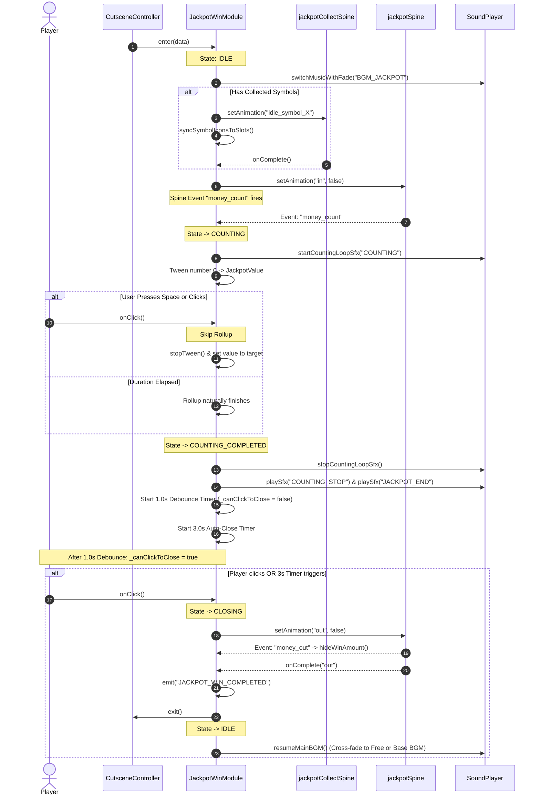

# 2. 🔄 State Machine & Lifecycle Flow

<!-- convention-summary-start -->
### Jackpot Win Cutscene - State Machine & Lifecycle Flow Summary

- **Core Architecture / Purpose**: Detailed specifications of the 4-state lifecycle machine controlling cutscene progression, event dispatching, and user interaction.
- **Key Mechanisms & Design**: `JackpotWinState` enum (`IDLE`, `COUNTING`, `COUNTING_COMPLETED`, `CLOSING`), sequence diagram, and safe state transitions.
- **Domain Capabilities**: feature, RECIPE_005_jackpot_win_celebration_cutscene
- **Scope & Code Paths**: `assets/cc-release-slot/cc1-red-cliff/scripts/Cutscene/JackpotWinModule9666.ts`
- **Related Docs**: [01. Overview](./01_overview_and_problem.md), [03. Dual-Spine Tracking](./03_dual_spine_and_bone_tracking.md)
<!-- convention-summary-end -->

---

## 2.1 The 4 Lifecycle States

```typescript
export enum JackpotWinState {
    IDLE = 0,               // Cutscene hidden or waiting
    COUNTING = 1,           // Money tweening up with audio loop
    COUNTING_COMPLETED = 2, // Rollup finished; 1s debounce active; waiting for user click or auto-close
    CLOSING = 3             // Playing out-animation before calling exit()
}
```

---

## 2.2 Sequence & State Transitions


